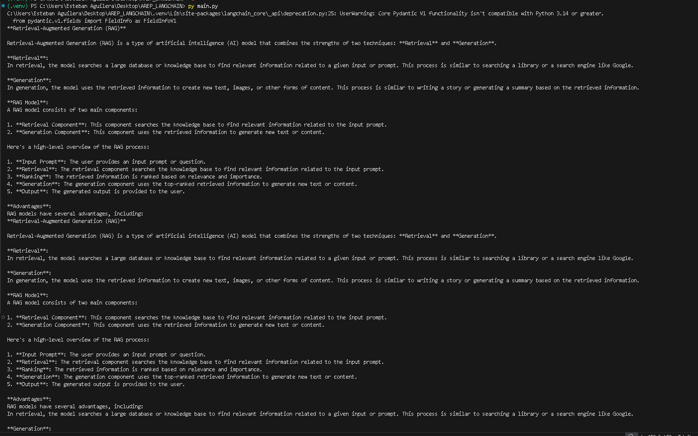

# LangChain LLM Chain – Integración con Groq (LLaMA 3.1)

## Introducción

Este trabajo lo hice para entender, de forma práctica y sin complicarlo demasiado, cómo funciona una **LLM Chain en LangChain** conectada a un modelo real. La idea no era construir un agente complejo todavía, sino comprender bien el flujo básico:

- cómo se inicializa un modelo,
- cómo se envía un prompt,
- y cómo se recibe una respuesta generada dinámicamente.

En vez de usar una API paga, integré **Groq** con el modelo **LLaMA 3.1**, lo que me permitió ejecutar el proyecto sin costos y mantener la arquitectura limpia. Me enfoqué en que el código fuera mínimo pero correcto, y que la explicación del flujo fuera clara.

---

## Arquitectura del Proyecto

El flujo es sencillo pero importante de entender:

Usuario (prompt)  
→ LangChain (ChatGroq)  
→ Modelo LLaMA 3.1 en Groq  
→ Generación de texto  
→ Respuesta impresa en consola  

Más detallado:

1. Se carga la API key desde `.env`.
2. Se inicializa el modelo con `ChatGroq`.
3. Se envía un prompt simple.
4. El modelo genera una respuesta basada en el input.
5. Se imprime el contenido generado.

Este patrón es la base sobre la cual luego se pueden construir:
- Chains más complejas
- Agentes
- Sistemas RAG
- Pipelines con memoria

---

## Archivo principal

`main.py`

```python
import os
from dotenv import load_dotenv
from langchain_groq import ChatGroq

load_dotenv()

llm = ChatGroq(
    model="llama-3.1-8b-instant",
    temperature=0
)

response = llm.invoke(
    "Explain Retrieval-Augmented Generation (RAG) in simple technical terms."
)

print(response.content)
```

---

## Requisitos

- Python 3.x  
- langchain  
- langchain-groq  
- python-dotenv  

Instalación:

```bash
pip install langchain langchain-groq python-dotenv
```

---

## Variables de Entorno

Archivo `.env`:

```
GROQ_API_KEY=key
```

El proyecto no funciona sin esta variable correctamente configurada.

---

## Cómo lo corrí en mi máquina (Windows)

1. Creé un entorno virtual:
   ```
   python -m venv .venv
   ```
2. Activé el entorno:
   ```
   .venv\Scripts\Activate.ps1
   ```
3. Instalé dependencias.
4. Ejecuté:
   ```
   py main.py
   ```

La respuesta se imprime directamente en consola.

---

## Evidencia de Ejecución

Ejemplo de salida generada:



## Conceptos Demostrados

- Inicialización de un LLM externo en LangChain.
- Uso de variables de entorno para credenciales.
- Flujo básico de invocación (`invoke`).
- Integración entre framework (LangChain) y proveedor externo (Groq).
- Generación determinista con `temperature=0`.

---

## Conclusión

- **Arquitectura**: Aunque es un ejemplo simple, muestra claramente la separación entre aplicación, framework y modelo.
- **Integración**: LangChain abstrae la complejidad del proveedor; cambiar de modelo solo requiere modificar parámetros.
- **Base para RAG**: Este flujo es exactamente el que luego se amplía al agregar un componente de recuperación (retriever + vector store).
- **Simplicidad**: Mantener el código pequeño permitió entender cada parte sin ocultar lógica detrás de librerías complejas.


---

## Información del Proyecto

- **Autor**: Esteban Aguilera Contreras  
- **Universidad**: Escuela Colombiana de Ingeniería Julio Garavito  
- **Asignatura**: Arquitecturas Empresariales (AREP)